# ITAM Maestría en Ciencia de Datos — Métodos de Gran Escala

## Autores

- **Blanca Azucena Orduña López**
- **Daniel Miranda Badillo**

**Repositorio:** <https://github.com/Mirandani/Arquitectura>

---

## Descripción del Proyecto

Este repositorio implementa un **pipeline completo de Machine Learning** para predecir ventas en retail usando técnicas de preparación de datos, entrenamiento de modelos y inferencia en batch.

### Caso de uso
Predecir ventas futuras de productos en diferentes tiendas basándose en datos históricos.

### Objetivo
Desarrollar un modelo escalable, testeable y containerizado que permita:
- **Preparación de datos** con validación automática
- **Entrenamiento flexible** con múltiples modelos y hiperparámetros configurables
- **Inferencia en batch** sobre nuevos datos
- **Calidad de código** mediante linting, formateo y pruebas unitarias

### Datos
- **Fuente:** Kaggle — [Predict Future Sales](https://www.kaggle.com/c/competitive-data-science-predict-future-sales)
- **Métricas de desempeño:**
  - RMSE Regresión Lineal (baseline): 0.9824
  - RMSE Random Forest: 0.9743 — mejora ~0.83% vs baseline
  - **RMSE XGBoost (SageMaker BYOC): 0.9474 — mejora ~3.56% vs baseline**

---

## Estructura del Repositorio

```
.
├── README.md                            # Este archivo
├── Makefile                             # Tareas de desarrollo y Docker
├── pyproject.toml                       # Configuración del proyecto (uv + pytest)
├── uv.lock                              # Dependencias fijadas
│
├── data/                                # Datos del pipeline
│   ├── raw/                             # Datos originales (sin procesar)
│   ├── prep/                            # Datos preparados (parquet)
│   ├── inference/                       # Datos para predicciones en batch
│   └── predictions/                     # Resultados de inferencia
│
├── artifacts/                           # Modelos entrenados y documentación
│   ├── models/
│   │   └── modelo_random_forest.joblib
│   ├── logs/                            # Logs de ejecución
│   └── documentation/
│       └── Executive_Summary.pdf
│
├── processing/
|   ├── container/
│   |   ├── Dockerfile                   # Imagen Docker para preprocessing BYOC
│   |   └── preprocess.py                # Funciones puras de transformación BYOC
|   └── notebooks
|       └── sagemaker_byok_sklearn.ipynb # Pipeline completo BYOC en SageMaker con sklearn
|
├── src/                                 # Código fuente modular
│   ├── utils/                           # Utilidades compartidas
│   │   ├── __init__.py
│   │   ├── logger.py                    # Configuración de logging
│   │   ├── model_tools.py               # Evaluación y serialización de modelos
│   │   ├── data_validation.py           # Validación de datos
│   │   ├── dtypes.py                    # Gestión de tipos de datos
│   │   └── outputs.py                   # Exportación de resultados
│   │
│   ├── preprocessing/                   # Módulo de preprocesamiento
│   │   ├── __init__.py
│   │   ├── Dockerfile                   # Imagen Docker para preprocessing
│   │   ├── __main__.py                  # CLI con argparse
│   │   └── preprocessing.py             # Funciones puras de transformación
│   │
│   ├── training/                        # Módulo de entrenamiento
│   │   ├── __init__.py
│   │   ├── Dockerfile                   # Imagen Docker (local y SageMaker BYOC)
│   │   ├── __main__.py                  # CLI con argparse
│   │   ├── train.py                     # Funciones puras de modelado (local)
│   │   ├── train                        # Script de entrenamiento SageMaker BYOC
│   │   ├── serve                        # Arranca nginx + gunicorn para inferencia
│   │   ├── predictor.py                 # Servidor Flask (/ping, /invocations)
│   │   ├── wsgi.py                      # Punto de entrada WSGI para gunicorn
│   │   ├── nginx.conf                   # Configuración del proxy reverso
│   │   ├── build_and_push.sh            # Build y push de la imagen a ECR
│   │   └── test/
│   │       ├── __init__.py
│   │       └── test_train.py            # Tests unitarios
│   │
│   └── inference/                       # Módulo de predicciones
│       ├── __init__.py
│       ├── Dockerfile                   # Imagen Docker para inferencia
│       ├── __main__.py                  # CLI con argparse
│       ├── inference.py                 # Funciones puras de predicción
│       └── test/
│           ├── __init__.py
│           └── test_inference.py        # Tests unitarios
│
├── notebooks/                           # Exploración y análisis
│   ├── modelo_retail.ipynb              # Análisis exploratorio y modelado local
│   └── sagemaker_xgboost.ipynb         # Pipeline completo BYOC en SageMaker
│
└── notes/                               # Documentación interna
    ├── buenas_practicas.md
    └── notas.md
```

---

## Git Workflow

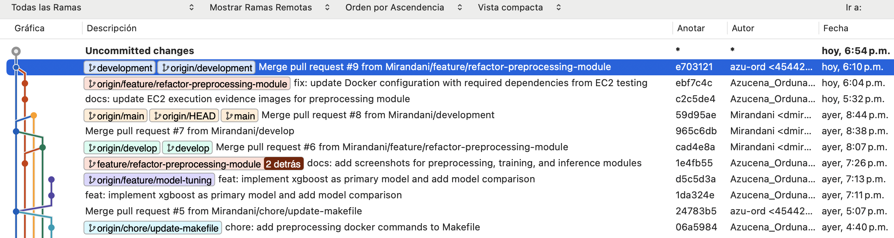

### Rama principal: `main`
- Código estable y testeado
- Se actualiza solo mediante Pull Requests

### Ramas de desarrollo: 
- `development` Integración (rama activa de desarrollo)
- `feature`     Integración (rama activa de desarrollo)
- `feature/refactor-inference-module`  Integración (Rama de desarrollo T04)
- `feature/refactor-preprocessing-module`  Integración (Rama de desarrollo T04)
- `feature/refactor-training-module`  Integración (Rama de desarrollo T04)
- `feature/sagemaker-training-byoc` Integración (Rama de desarrollo sagemaker T05)

```bash
git checkout -b feature/nombre-feature    # Rama para nuevas funcionalidades
git checkout -b fix/nombre-bug            # Rama para correcciones
git checkout development                  # Rama de desarrollo
git pull origin devlopment                # Actualización de la rama

```

### Proceso de integración
1. Crear rama desde `main`
2. Realizar cambios y commits
3. Crear Pull Request con descripción clara
4. Pasar tests y revisión de código
5. Merge a `main`

---

## Instalación y Setup

### Requisitos previos
- **Python:** 3.12+
- **Docker:** (opcional, para ejecución containerizada)
- **Git:** para clonar el repositorio

### 1. Clonar el repositorio

```bash
git clone https://github.com/Mirandani/Arquitectura.git
cd Arquitectura
```

### 2. Crear e instalar el ambiente virtual

```bash
# Instalar dependencias con uv
uv sync

# Activar el ambiente (opcional, uv run lo hace automáticamente)
source .venv/bin/activate  # en macOS/Linux
```

### 3. Verificar instalación

```bash
uv run python -c "import pandas; print('✓ Dependencias instaladas')"
```

---

## Ejecución del Pipeline Completo

### Opción A: Sin Docker (local)

```bash
# 0. Preprocesamiento de datos (limpieza, ingeniería de características)
uv run python -m preprocessing

# 1. Entrenamiento con defaults
uv run python -m training

# 2. Inferencia con defaults
uv run python -m inference
```

### Opción B: Con Docker (contenedores aislados)

#### Paso 0: Preprocesamiento de datos

```bash
make docker-build-prep
make docker-run-prep
```

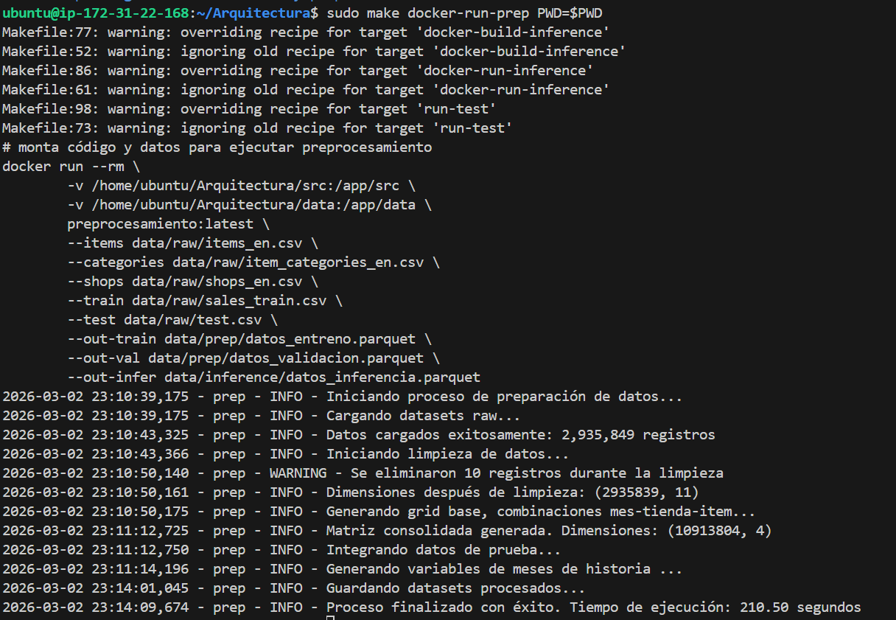

#### Paso 1: Entrenamiento con defaults

```bash
make docker-build-train
make docker-run-train
```

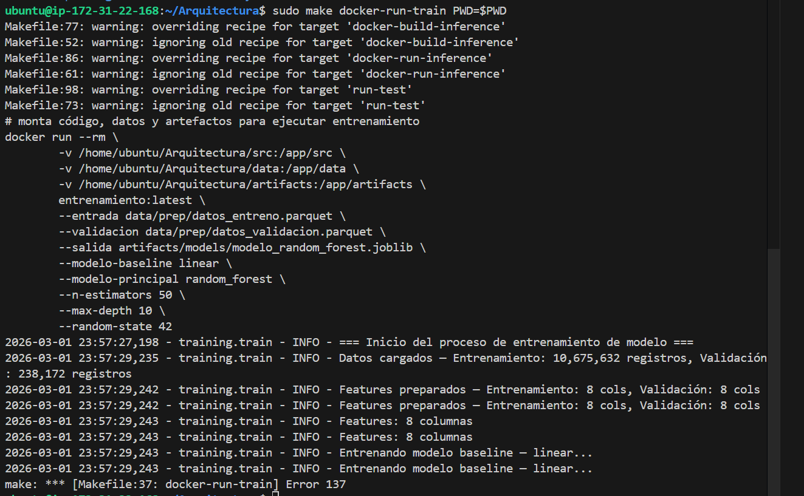

#### Paso 2: Inferencia con defaults

```bash
make docker-build-inference
make docker-run-inference
```

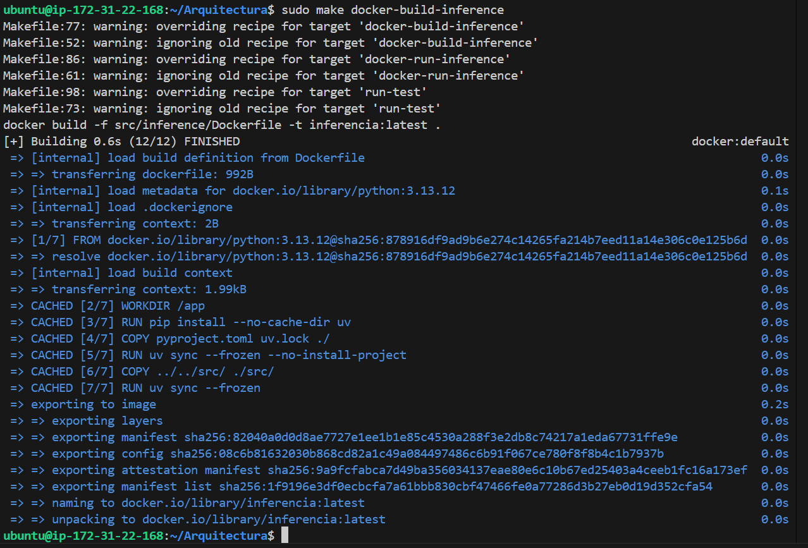

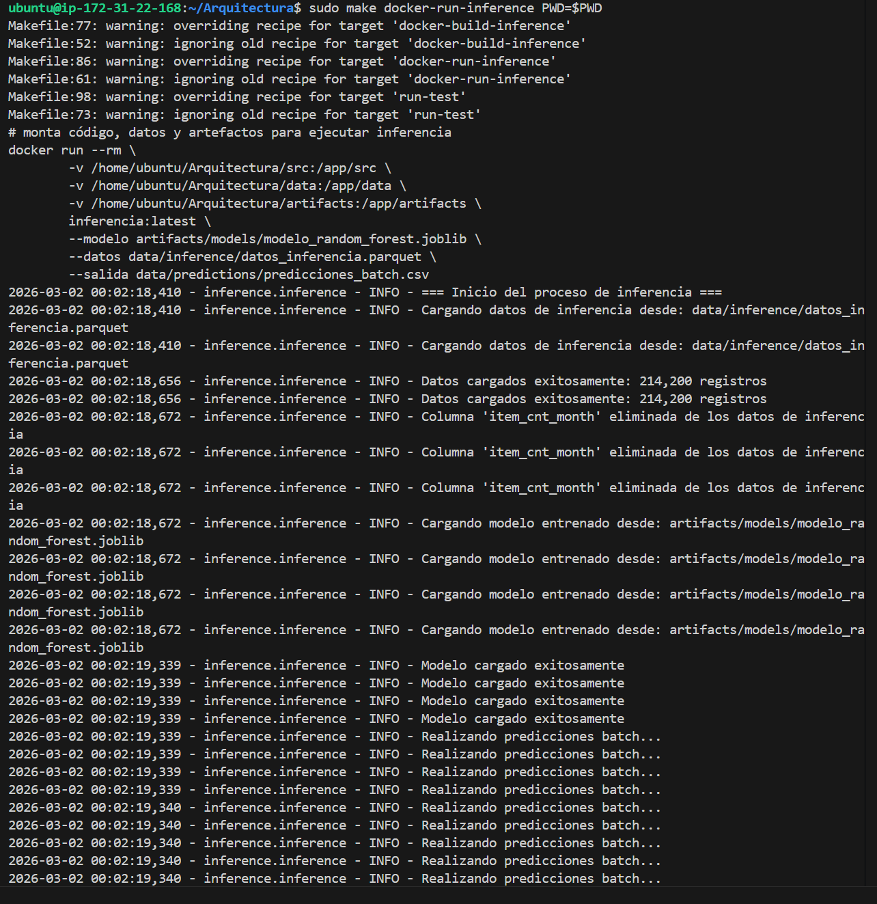
---

## Ejecución de Contenedores con Argumentos

### Preprocessing — Rutas de Datos Configurables

**Estructura base:**
```bash
make docker-run-prep \
  ITEMS_PATH=data/raw/items_en.csv \
  CATEGORIES_PATH=data/raw/item_categories_en.csv \
  SHOPS_PATH=data/raw/shops_en.csv \
  TRAIN_PATH=data/raw/sales_train.csv \
  TEST_PATH=data/raw/test.csv \
  OUT_TRAIN=data/prep/datos_entreno.parquet \
  OUT_VAL=data/prep/datos_validacion.parquet \
  OUT_INFER=data/inference/datos_inferencia.parquet
```

**Ejemplos:**

```bash
# Preprocesamiento con rutas customizadas
make docker-run-prep \
  TRAIN_PATH=data/raw/sales_train_full.csv \
  OUT_TRAIN=data/prep/entreno_v2.parquet

# Cambiar solo rutas de salida
make docker-run-prep \
  OUT_TRAIN=data/prep/entreno_completo.parquet \
  OUT_VAL=data/prep/validacion_completo.parquet
```

### Training — Modelos y Hiperparámetros Configurables

**Estructura base:**
```bash
make docker-run-train \
  MODELO_BASE=linear \
  MODELO_PRINCIPAL=random_forest \
  N_ESTIMATORS=200 \
  MAX_DEPTH=6 \
  RANDOM_STATE=42
```

**Ejemplos:**

```bash
# Random Forest con hiperparámetros personalizados
make docker-run-train \
  MODELO_PRINCIPAL=random_forest \
  N_ESTIMATORS=200 \
  MAX_DEPTH=8

# Random Forest vs Random Forest (comparar configuraciones)
make docker-run-train \
  MODELO_BASE=random_forest \
  MODELO_PRINCIPAL=random_forest \
  RANDOM_STATE=123

# Lineal vs Lineal (baseline puro)
make docker-run-train \
  MODELO_BASE=linear \
  MODELO_PRINCIPAL=linear
```

### Inference — Datos y Rutas Personalizadas

**Estructura base:**
```bash
make docker-run-inference \
  DATOS=data/inference/datos_inferencia.parquet \
  MODELO=artifacts/models/modelo_random_forest.joblib \
  SALIDA=data/predictions/predicciones_batch.csv
```

**Ejemplos:**

```bash
# Inferencia con datos alternativos
make docker-run-inference \
  DATOS=data/inference/datos_nuevos.parquet

# Cambiar ruta de salida
make docker-run-inference \
  SALIDA=data/predictions/predicciones_v2.csv
```

### Variables de configuración en el Makefile

#### Preprocessing
| Variable | Default | Descripción |
|----------|---------|-------------|
| `ITEMS_PATH` | `data/raw/items_en.csv` | Catálogo de productos |
| `CATEGORIES_PATH` | `data/raw/item_categories_en.csv` | Categorías de productos |
| `SHOPS_PATH` | `data/raw/shops_en.csv` | Información de tiendas |
| `TRAIN_PATH` | `data/raw/sales_train.csv` | Datos históricos de ventas |
| `TEST_PATH` | `data/raw/test.csv` | Datos de prueba para inferencia |
| `OUT_TRAIN` | `data/prep/datos_entreno.parquet` | Salida: datos de entrenamiento |
| `OUT_VAL` | `data/prep/datos_validacion.parquet` | Salida: datos de validación |
| `OUT_INFER` | `data/inference/datos_inferencia.parquet` | Salida: datos de inferencia |

#### Training
| Variable | Default | Descripción |
|----------|---------|-------------|
| `MODELO_BASE` | `linear` | Modelo baseline para comparación |
| `MODELO_PRINCIPAL` | `random_forest` | Modelo principal (se guarda) |
| `N_ESTIMATORS` | 50 | Número de árboles (RandomForest) |
| `MAX_DEPTH` | 10 | Profundidad máxima (RandomForest) |
| `RANDOM_STATE` | 42 | Semilla de reproducibilidad |
| `ENTRADA` | `data/prep/datos_entreno.parquet` | Ruta datos entrenamiento |
| `VALIDACION` | `data/prep/datos_validacion.parquet` | Ruta datos validación |
| `SALIDA_TRAIN` | `artifacts/models/modelo_random_forest.joblib` | Ruta modelo guardado |

#### Inference
| Variable | Default | Descripción |
|----------|---------|-------------|
| `DATOS` | `data/inference/datos_inferencia.parquet` | Ruta datos inferencia |
| `SALIDA` | `data/predictions/predicciones_batch.csv` | Ruta predicciones |

---

## Pipeline Completo: Ejecución Rápida

Ejecuta todos los pasos en orden (preprocessing → training → inference):

```bash
# Con valores por defecto
make docker-build-prep docker-build-train docker-build-inference && \
make docker-run-prep && \
make docker-run-train && \
make docker-run-inference

# Con parámetros personalizados
make docker-build-prep docker-build-train docker-build-inference && \
make docker-run-prep && \
make docker-run-train \
  MODELO_PRINCIPAL=random_forest \
  N_ESTIMATORS=200 \
  MAX_DEPTH=8 && \
make docker-run-inference
```

---

## Pruebas Unitarias

### Ejecutar todas las pruebas

```bash
# Todos los tests
uv run pytest -v

# Solo training
uv run pytest -v src/training/test

# Solo inference
uv run pytest -v src/inference/test

# Con cobertura
uv run pytest --cov=src src/

# Ejecución de test con makefile
make run-test
```

### Estructura de tests

Cada módulo tiene tests unitarios que prueban **funciones puras** con datos sintéticos:

#### `src/training/test/test_train.py` — 8 tests
- `test_preparar_datos_elimina_target_de_features` ✓
- `test_preparar_datos_conserva_features` ✓
- `test_preparar_datos_target_correcto` ✓
- `test_preparar_datos_lanza_error_sin_target` ✓
- `test_construir_modelo_random_forest_retorna_tipo_correcto` ✓
- `test_construir_modelo_linear_retorna_tipo_correcto` ✓
- `test_construir_modelo_random_forest_respeta_hiperparametros` ✓
- `test_construir_modelo_tipo_invalido_lanza_error` ✓

#### `src/inference/test/test_inference.py` — 5 tests
- `test_preparar_datos_elimina_columna_target` ✓
- `test_preparar_datos_sin_columna_target` ✓
- `test_generar_predicciones_con_modelo_mock` ✓
- `test_resumen_predicciones` ✓
- `test_guardar_predicciones` ✓

---
#### 100% Cobertura de las pruebas unitarias
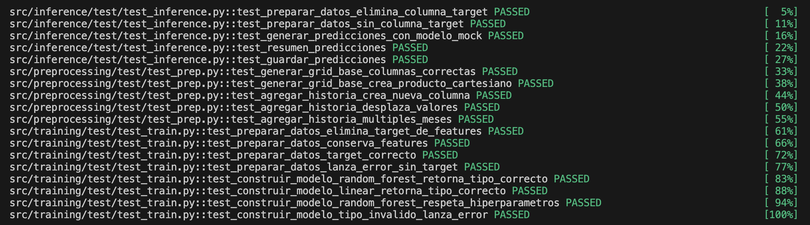

---

## Despliegue en AWS EC2

### Configuración de la instancia

#### 1. Crear instancia EC2 en AWS

```bash
# Requisitos mínimos:
# - Imagen: Ubuntu 22.04 LTS (AMI)
# - Tipo: t3.medium o superior
# - Storage: 30 GB (gp3)
# - Security Group: permitir SSH (puerto 22) y acceso interno
```

#### 2. Conectarse a la instancia

```bash
# Desde tu máquina local
ssh -i "tu-key.pem" ubuntu@tu-instancia-ec2-ip
```

#### 3. Instalar Docker en la instancia

```bash
# Actualizar sistema
sudo apt-get update
sudo apt-get upgrade -y

# Instalar Docker
sudo apt-get install -y docker.io

# Dar permisos al usuario ubuntu
sudo usermod -aG docker ubuntu
newgrp docker

# Verificar instalación
docker --version
```

#### 4. Clonar el repositorio en la instancia

```bash
cd /home/ubuntu
git clone https://github.com/Mirandani/Arquitectura.git
cd Arquitectura
```

### Ejecución del pipeline en producción

#### Opción 1: Pipeline completo con defaults

```bash
# Construir todas las imágenes Docker
make docker-build-prep docker-build-train docker-build-inference

# Ejecutar pipeline completo
make docker-run-prep && \
make docker-run-train && \
make docker-run-inference
```

#### Opción 2: Con parámetros personalizados

```bash
# Construir imágenes
make docker-build-prep docker-build-train docker-build-inference

# Ejecutar con modelos y hiperparámetros específicos
make docker-run-prep && \
make docker-run-train \
  MODELO_BASE=linear \
  MODELO_PRINCIPAL=random_forest \
  N_ESTIMATORS=200 \
  MAX_DEPTH=8 && \
make docker-run-inference \
  SALIDA=data/predictions/predicciones_produccion.csv
```

### Captura de pantalla — Ejecución en AWS EC2

A continuación se muestra la ejecución del pipeline en una instancia EC2 con Ubuntu 22.04:

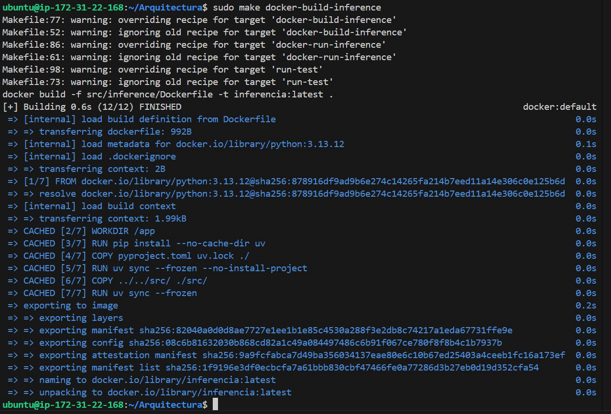


## Comandos de Desarrollo (Makefile)

### Linting

```bash
make lint              # Pylint en terminal
make lint-report       # Pylint con reporte en archivo
```

### Formateo de código

```bash
make format-black      # Formatea con Black
make format-black-check # Verifica sin modificar
make format-ruff       # Formatea con Ruff
make format-ruff-check # Verifica con Ruff
```

### Testing

```bash
make run-test          # Ejecuta pytest -v (todos los tests)
```

### Utilidades

```bash
make tree              # Muestra estructura del proyecto
make help              # Listado de todos los comandos disponibles
```

---

## Arquitectura de Código

### Principios de diseño

1. **Modularidad:** Cada paso del pipeline es un módulo independiente
2. **Testabilidad:** Funciones puras sin efectos secundarios
3. **Configurabilidad:** Argumentos CLI en lugar de valores hardcodeados
4. **Escalabilidad:** Containerización con Docker para reproducibilidad
5. **Calidad:** Linting, formateo y tests automáticos

### Flujo de datos

```
items.csv, categories.csv, shops.csv, sales_train.csv, test.csv
    ↓
[PREPROCESSING] → merge tables + validación + feature engineering
    ↓
parquet files
    ├── datos_entreno.parquet (80%)
    ├── datos_validacion.parquet (20%)
    └── datos_inferencia.parquet (test)
    ↓
[TRAINING] → preparar_datos() → construir_modelo() → evaluar()
    ↓
modelo_random_forest.joblib (se guarda el principal)
    ↓
[INFERENCE] → preparar_datos() → predecir() → resumen_predicciones()
    ↓
predicciones_batch.csv
```

---

## Dependencias Principales

| Librería | Versión | Uso |
|----------|---------|-----|
| pandas | ≥3.0.0 | Manipulación de datos |
| numpy | ≥2.4.1 | Operaciones numéricas |
| scikit-learn | ≥1.8.0 | Modelado y evaluación |
| joblib | (via sklearn) | Serialización de modelos |
| pyarrow | ≥23.0.0 | Archivos Parquet |
| pytest | (via pyproject.toml) | Tests unitarios |
| black | ≥26.1.0 | Formateo de código |
| pylint | ≥4.0.4 | Análisis de código |
| ruff | ≥0.15.0 | Formateo y linting |

---

## Calidad de Código

### Resultados de análisis estático

- **Pylint:** 10.00/10
- **Black:** Conforme
- **Ruff:** Conforme

### Cobertura de tests

```
src/training/test/ — 8/8 tests ✓ (100%)
src/inference/test/ — 5/5 tests ✓ (100%)
```

---

## Logs de Ejecución

Los logs de cada ejecución se guardan en `artifacts/logs/` con timestamps:

```bash
artifacts/logs/
├── training_20260228_120000.log
├── inference_20260228_120500.log
└── prep_20260228_120100.log
```

Cada log contiene:
- Timestamp de inicio/fin
- Métricas de desempeño (RMSE, mejora, etc.)
- Errores y advertencias
- Rutas de archivos generados

---

## Notas Importantes

### PYTHONPATH en Docker

El `PYTHONPATH=/app/src` en los Dockerfiles permite que Python encuentre los módulos:
- `training`, `inference`, `utils` directamente en imports
- Consistente con la configuración de pytest en `pyproject.toml`

### Argparse vs CLI directo

Todos los módulos usan `__main__.py` con argparse para CLI consistente:
```bash
python -m training --modelo random_forest --n-estimators 200
python -m inference --datos data/inference/nuevos.parquet
```

### Separación de I/O y lógica

Las funciones en `train.py` e `inference.py` son **puras** (sin I/O):
- `preparar_datos(df)` ← recibe DataFrame en memoria
- `construir_modelo(tipo)` ← retorna instancia de modelo
- `predecir(modelo, datos)` ← no accede a archivos

El I/O (read/write de archivos) ocurre en `main()`.

---

## Contacto y Contribuciones

Para sugerencias o reportes de bugs, crear un Issue o Pull Request en el repositorio.

---

---

## Despliegue en AWS SageMaker (BYOC)

Esta sección documenta el flujo de entrenamiento e inferencia usando **Bring Your Own Container (BYOC)** en SageMaker. A diferencia del pipeline local/EC2, aquí SageMaker gestiona el cómputo, los datos y el ciclo de vida del modelo.

### Archivos involucrados

| Archivo | Descripción |
|---------|-------------|
| `src/training/Dockerfile` | Imagen Docker basada en Ubuntu 22.04 con XGBoost, Flask y Gunicorn |
| `src/training/build_and_push.sh` | Build de la imagen y push a Amazon ECR |
| `src/training/train` | Script de entrenamiento ejecutado por SageMaker (`docker run <image> train`) |
| `src/training/serve` | Arranca nginx + gunicorn para servir el endpoint (`docker run <image> serve`) |
| `src/training/predictor.py` | Servidor Flask con endpoints `/ping` e `/invocations` |

---

### Requisitos previos

- AWS CLI configurado con credenciales activas (`aws configure`)
- Permisos IAM: `AmazonECR*`, `AmazonSageMaker*`
- Docker instalado y corriendo localmente
- Python con boto3 instalado (`uv sync`)

---

### Paso 1: Build y push de la imagen a ECR

```bash
bash src/training/build_and_push.sh <nombre-imagen>
```

El script automáticamente:
1. Obtiene el Account ID y región de las credenciales AWS activas
2. Crea el repositorio en ECR si no existe
3. Autentica Docker contra ECR
4. Construye la imagen desde `src/training/Dockerfile`
5. Tagea y sube la imagen a ECR

La imagen resultante queda en:
```
<account>.dkr.ecr.<region>.amazonaws.com/<nombre-imagen>:latest
```

Imagen desplegada en ECR: sagemaker-xgboost-byoc

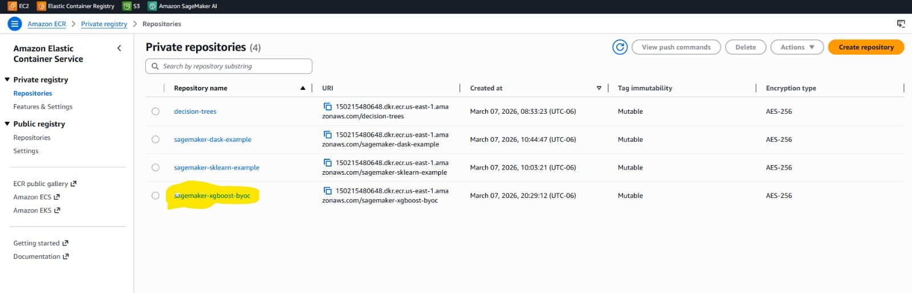

> **Nota:** El flag `--network sagemaker` en el build es requerido si ejecutas desde SageMaker Studio.

---

### Paso 2: Training Job en SageMaker

SageMaker ejecuta `docker run <image> train` y monta los datos automáticamente desde S3.

#### Contrato de directorios dentro del contenedor

| Ruta | Contenido |
|------|-----------|
| `/opt/ml/input/data/training/` | `datos_entreno.parquet` y `datos_validacion.parquet` (montados desde S3) |
| `/opt/ml/input/config/hyperparameters.json` | Hiperparámetros del job (todos como strings) |
| `/opt/ml/model/` | Modelo entrenado (`modelo_xgboost.joblib`) — SageMaker lo sube a S3 al finalizar |
| `/opt/ml/output/failure` | Mensaje de error si el job falla (visible en `DescribeTrainingJob`) |

#### Hiperparámetros soportados

| Parámetro | Tipo | Default | Descripción |
|-----------|------|---------|-------------|
| `n_estimators` | int | `100` | Número de árboles XGBoost |
| `max_depth` | int / `"None"` | `6` | Profundidad máxima de los árboles |

#### Ejemplo con SageMaker Python SDK

```python
import sagemaker
from sagemaker import get_execution_role

# Configuración de sesión
sess = sagemaker.Session()
role = get_execution_role()
account = sess.boto_session.client("sts").get_caller_identity()["Account"]
region = sess.boto_session.region_name

# Subir datos de entrenamiento a S3
prefix = "retail-sales-xgboost-byoc-v3"
data_location = sess.upload_data("data/prep", bucket=sess.default_bucket(), key_prefix=prefix)

# Definir imagen y ruta de salida
image_name = "sagemaker-xgboost-byoc"
image_uri = f"{account}.dkr.ecr.{region}.amazonaws.com/{image_name}:latest"
s3_output_path = f"s3://{sess.default_bucket()}/{prefix}/output"

# Crear estimator y lanzar el training job
xgb_estimator = sagemaker.estimator.Estimator(
    image_uri=image_uri,
    role=role,
    instance_count=1,
    instance_type="ml.m5.large",
    output_path=s3_output_path,
    sagemaker_session=sess,
    hyperparameters={
        "n_estimators": "150",
        "max_depth": "8",
    },
)

xgb_estimator.fit({"training": data_location})
```

#### Exit codes del script `train`

| Código | Significado |
|--------|-------------|
| `0` | Training exitoso → job `Succeeded` |
| `255` | Error → job `Failed`, razón en `/opt/ml/output/failure` |

---

### Paso 3: Endpoint de inferencia

SageMaker ejecuta `docker run <image> serve`, que levanta el stack:

```
SageMaker → nginx (proxy reverso) → gunicorn (socket Unix) → Flask (predictor.py)
```

Endpoint Desplegado:

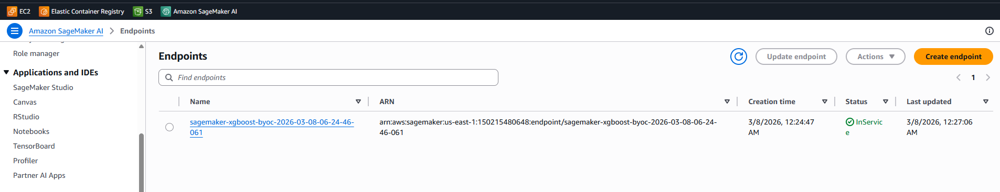

#### Variables de entorno del servidor

| Variable | Default | Descripción |
|----------|---------|-------------|
| `MODEL_SERVER_WORKERS` | núcleos de CPU | Número de workers de gunicorn |
| `MODEL_SERVER_TIMEOUT` | `60` | Timeout en segundos por request |

#### Endpoints del servidor Flask

**`GET /ping`** — Health check
```
200 → modelo cargado correctamente
404 → modelo no disponible
```

**`POST /invocations`** — Inferencia
```
Content-Type: text/csv
Body: datos sin header, una fila por predicción

Response (200): CSV con una predicción por línea
Response (415): si el Content-Type no es text/csv
```

#### Ejemplo de deploy e invocación

```python
import pandas as pd
from sagemaker.serializers import CSVSerializer

# Deploy del modelo entrenado
predictor = xgb_estimator.deploy(
    initial_instance_count=1,
    instance_type="ml.m5.large",
    serializer=CSVSerializer(),
)

# Preparar muestra de datos (sin columna target)
df_val = pd.read_parquet("data/prep/datos_validacion.parquet")
X_sample = df_val.drop(["item_cnt_month"], axis=1).sample(5)

# Predicción
response = predictor.predict(X_sample.values).decode("utf-8")
print("Predicciones (unidades estimadas por mes):")
print(response)

# Limpieza del endpoint al terminar
sess.delete_endpoint(predictor.endpoint)
```

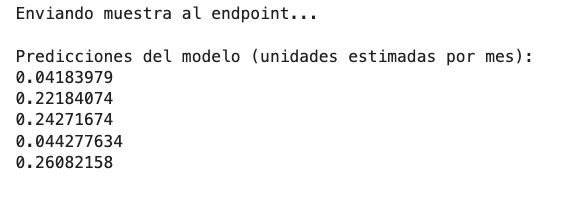

---

### Flujo completo SageMaker

```
S3 (datos_entreno.parquet, datos_validacion.parquet)
        │
        ▼
bash build_and_push.sh <nombre-imagen>
        │
        ▼
ECR (<account>.dkr.ecr.<region>.amazonaws.com/<nombre-imagen>:latest)
        │
        ▼
SageMaker Training Job
  docker run <image> train
  -> lee /opt/ml/input/data/training/
  -> entrena XGBRegressor
  -> guarda /opt/ml/model/modelo_xgboost.joblib
        │
        ▼
S3 (modelo_xgboost.joblib)
        │
        ▼
SageMaker Endpoint
  docker run <image> serve
  -> nginx + gunicorn + Flask
  -> POST /invocations (text/csv) → predicciones CSV
```

### Resultados del Training Job

**RMSE XGBoost (SageMaker BYOC): 0.9474**

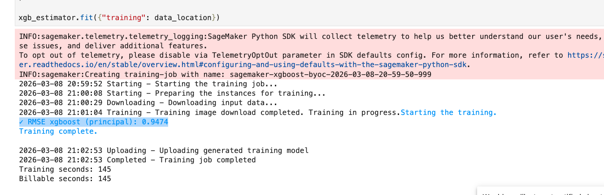

### Predicciones en tiempo real

Muestra de 5 predicciones obtenidas desde el endpoint desplegado (unidades estimadas por mes):

```
0.04183979
0.22184074
0.24271674
0.044277634
0.26082158
```


---
## SageMaker Processing Job — BYOC con scikit-learn

Esta sección documenta el flujo de preprocesamiento de datos utilizando **Amazon SageMaker Processing** con un contenedor propio (Bring Your Own Container) con scikit-learn.

| Archivo | Descripción |
|---------|-------------|
| `processing/container/Dockerfile` | Imagen Docker ligera basada en `python:3.11-slim` con dependencias de procesamiento |
| `processing/container/preprocess.py` | Script de transformación ejecutado por `ScriptProcessor` |
| `processing/notebooks/sagemaker_processing.ipynb` | Notebook cpn el proceso end to end para ejecución.
---

### Descripción del preprocesamiento

1. **Lectura y limpieza:** Integración de los catálogos (`items_en.csv`, `item_categories_en.csv`, `shops_en.csv`) con el histórico de ventas (`sales_train.csv`). Se aplican filtros para eliminar outliers:
   - Precios negativos (`<= 0`)
   - Precios atípicos (`>= 100,000`)
   - Ventas diarias atípicas (`>= 1,000`)
2. **Consolidación:** Creación de una matriz base con todas las combinaciones posibles de `mes-tienda-item`. Las ventas diarias se agrupan a nivel mensual (`item_cnt_month`) y se topan a un máximo de 20 unidades para estabilizar la varianza.
3. **Ingeniería de variables:** Generación de variables históricas (lags) integrando las ventas de los meses anteriores al registro actual.
4. **División temporal de los datos::** Divide el dataset cronológicamente con el número de mes (entrenamiento <33, validación=33, inferencia=34).
5. **Output:** guarda 3 archivos en formato .parquet (datos_entreno.parquet, datos_validacion.parquet y datos_inferencia.parquet) en la ruta /opt/ml/processing/output/ .
---
## Flujo Completo SageMaker Processing

```text
S3 (datos brutos: sales_train.csv, test.csv, catálogos, etc.)
        │
        ▼
Construcción de docker, push y autenticación en AWS
        │
        ▼
SageMaker ScriptProcessor
  -> Descarga inputs a /opt/ml/processing/input/
  -> Ejecuta: preprocess.py
  -> Guarda parquet en /opt/ml/processing/output/
        │
        ▼
S3 (datos_entreno.parquet, datos_validacion.parquet, datos_inferencia.parquet)
```
---
## Evidencias de ejecución

1. Imagen desplegada en ECR: **sagemaker_sklearn_preprocess**

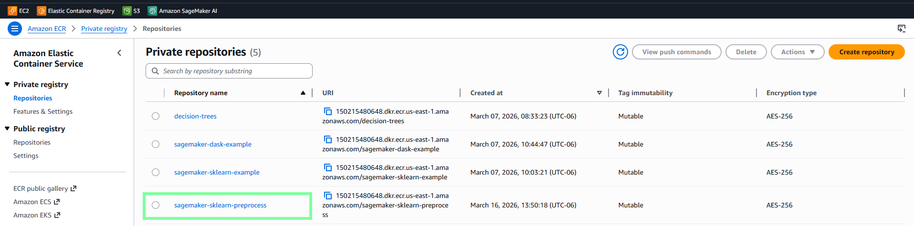

2. Processing Job en exitoso
   
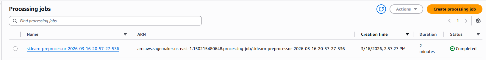

3. Output en S3

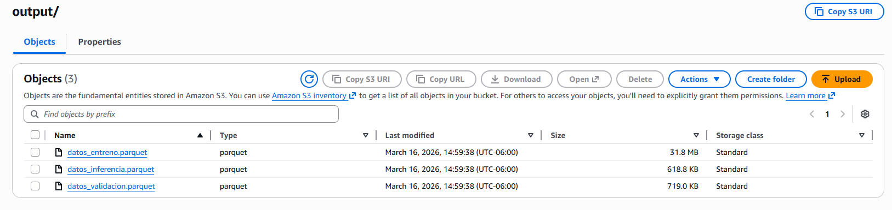

4. Inspección del output
   
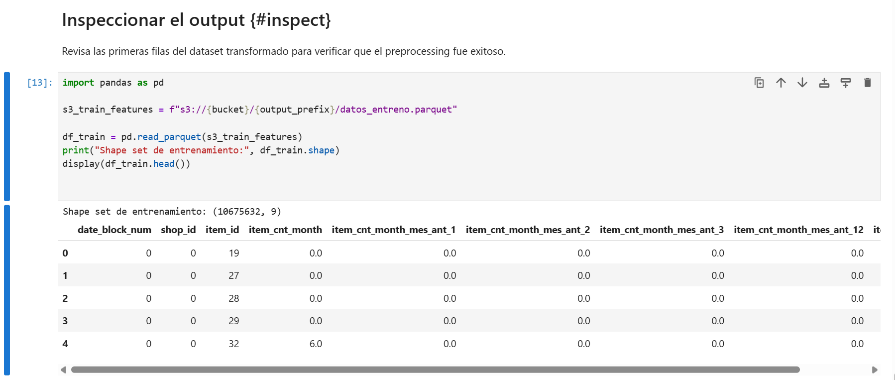

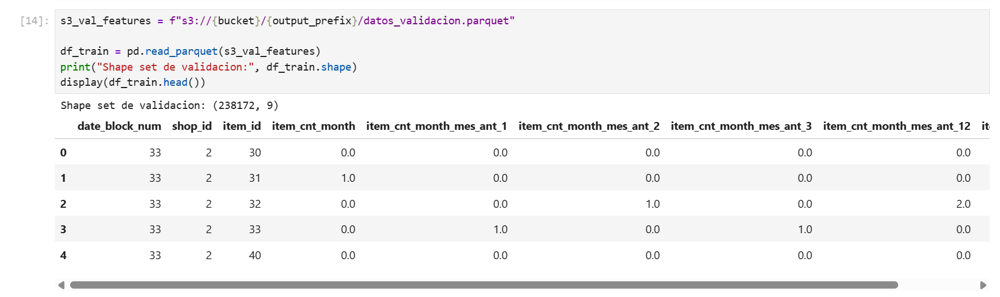

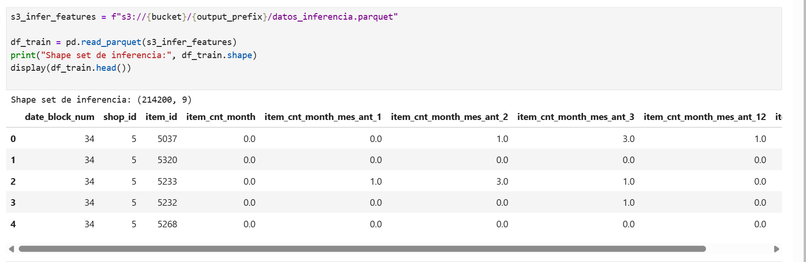

---

**Última actualización:** Marzo 2026


